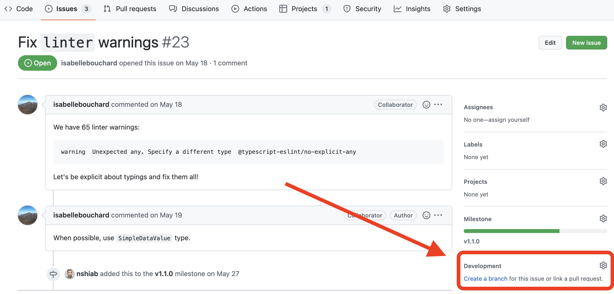
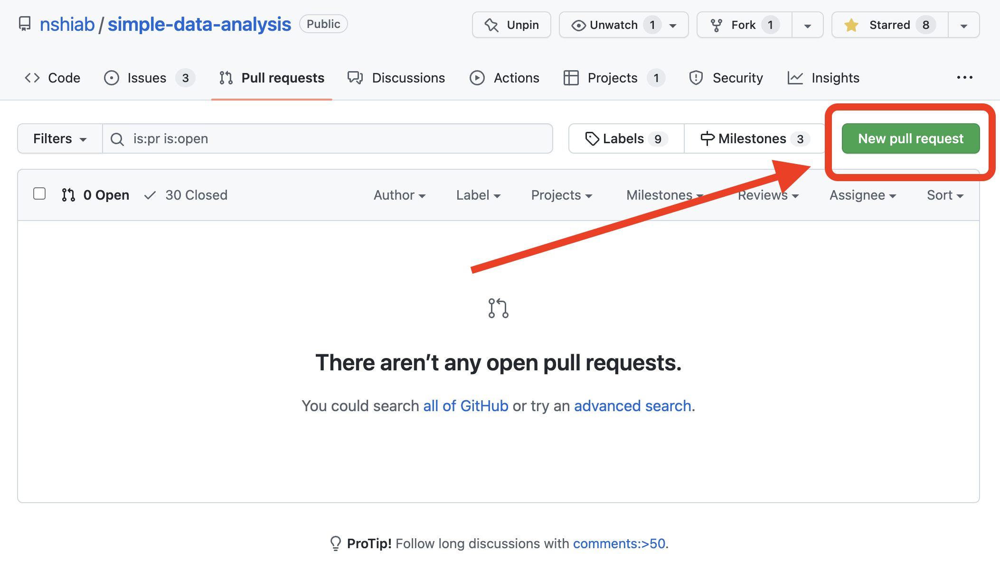

# How to contribute

This page explains how you can contribute to the simple-data-analysis library.

Feel free to start a [conversation](https://github.com/nshiab/simple-data-analysis/discussions) if some questions you have are not answered below.

You can also check [this tutorial](https://github.com/firstcontributions/first-contributions) as a ressource.

If you don't feel comfortable playing with the project's code, keep in mind that starting a conversation about a new feature or flagging a bug is already of great help! :)

And thank you for your interest in contributing!

## 1 - Create an issue

The first step is to create an issue with a clear title and a description of the problem you encountered:
https://github.com/nshiab/simple-data-analysis/issues

If you want to solve the problem, explain what you have in mind and how you want to proceed.

## 2 - Fork / create a branch

If you are not a contributor to the repository, fork the repository.

Once the issue is published, create a new branch. By default, the name of the branch will be the issue title. Adjust the name to make it more readable if needed.

If you are a contributor, create the branch within the original repository. If you are not a contributor, create it inside your forked repository.

## 3 - Do your magic

Clone the repository (or forked repository), check out to your branch, and have fun!

The suggested workflow is to create several tests in `test/unit/` with the expected outputs. Then add functions in `src/` and write them to pass your tests.

It's a great way to stay focused and break down the tasks into small steps.

We use [mocha](https://mochajs.org/) for the tests and the library is coded with [TypeScript](https://www.typescriptlang.org/). Here's how to run a specific test file with one or more tests in it:

`npx mocha --require ts-node/register ./test/unit/methods/analyzing/summarize.test.ts`

Read the tests and the functions already present as inspirations. Do your best to write clear and understandable code.

When committing your work, keep in mind that your messages are public.

If you have any questions at any step, leave a comment on the relevant issue.

## 4 - Final tests

When your new code passes all your tests, you can add it to the SimpleData class in `src/class/SimpleData.ts` (or in the relevant class).

Again, check how the other methods and functions are added and take them as examples.

You can now move on to the integration test in `test/integration/SimpleData.test.ts` (or in the relevant class).

Chain your method to the others and run `npm run test-simple-data` (or `npm run test-simple-data-node`) to ensure that your code works in a (somewhat) real context.

When all the steps above are dealt with, it's time for the final test: run `npm run allTests`.

Make sure to correct any remaining problems, like linter warnings.

## 5 - Pull request

It's now time to share your wonderful work!

First, you need to make sure that your code is up-to-date. Some changes could have been pushed to the main branch while you worked on your branch or forked repo.

If you have conflicts, adapt your code to solve them.

Don't forget to commit and push your changes.

And now create a pull request! Choose your branch. Explain what you did in your code and what issue you solved.

An experienced contributor will look at your proposition. They might ask questions and suggest modifications to your code.

When all questions are answered, and modifications are done, your code will be merged into the main branch and officially part of the library! Congrats!
