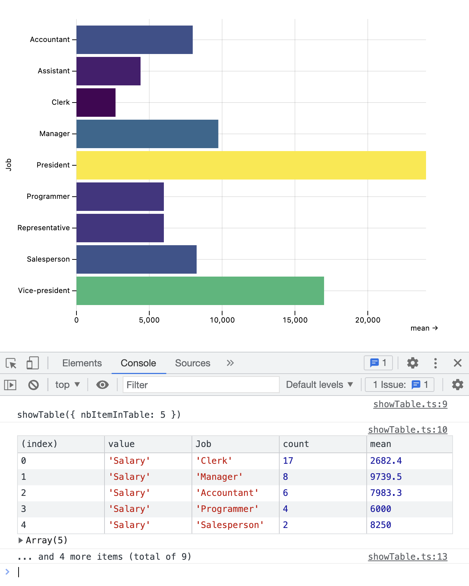
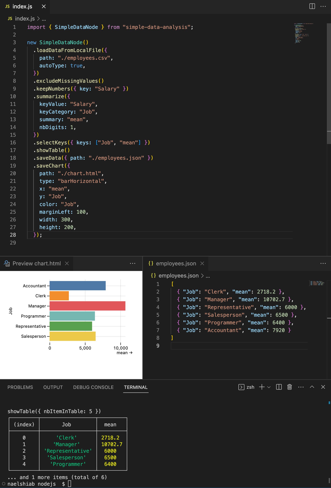

# Simple data analysis (SDA) in JavaScript


This repository is maintained by [Nael Shiab](http://naelshiab.com/), senior data producer at [CBC/Radio-Canada](https://cbc.radio-canada.ca/).

If you use the library, show off your work and tag me on [Mastodon](https://vis.social/@naelshiab), [Twitter](https://twitter.com/NaelShiab) or [LinkedIn](https://www.linkedin.com/in/naelshiab/)! :)

This project is related to [SDA-Flow](https://github.com/nshiab/simple-data-analysis-flow), which allows you to use the simple-data-analysis.js library without code. You can use it here (still under heavy development): https://nshiab.github.io/simple-data-analysis-flow/.

These project's goals are:

-   To ease the way for non-coders (especially journalists) into the beautiful world of data analysis and data visualization in JavaScript.

-   To standardize and accelerate frontend/backend workflows with a simple-to-use library working both in the browser and with NodeJS.

We are always trying to improve it. Feel free to start a conversation or open an issue, and check [how you can contribute](https://github.com/nshiab/simple-data-analysis/blob/main/CONTRIBUTING.md).

The documentation is available [here](https://nshiab.github.io/simple-data-analysis.js/) and more demos [here](https://observablehq.com/@nshiab/simple-data-analysis?collection=@nshiab/simple-data-analysis-in-javascript).

# Table of contents

1. [Core principles](#core-principles)
2. [Easiest way to use](#the-easiest-way-to-use-the-library)
3. [Simple example from the HTML](#simple-example-from-the-html)
4. [NodeJS and JavaScript bundlers](#working-with-nodejs-and-javascript-bundlers)
5. [Using it with React](#using-it-with-react)
6. [Using it with D3](#using-it-with-d3)
7. [Using it with ThreeJS / React-three-fiber (shaders)](#using-it-with-threejs--react-three-fiber-shaders)
8. [SimpleData class](#simpledata-class)
9. [SimpleDataNode class](#simpledatanode-class)
10. [All functions and methods](#all-functions-and-methods)

## Core principles

Under the hood, SDA is based on [D3 modules](https://github.com/d3/d3), [Observable Plot](https://github.com/observablehq/plot), [Lodash](https://lodash.com/) and other open-source JavaScript libraries. The focus is on providing code that is easy to use and understand.

The library expects **tabular data** stored in CSV/TSV files or **arrays of objects** stored in JSON files. It works best when the data is tidy:

1. Every key (or column) is a variable

2. Every item (or row) is an observation

3. Every value (or cell) is a single value

```js
// This is an array.
const data = [
    // This is an item
    {
        // firstName is a key
        firstName: "Nael", // "Nael" is a value
        // lastName is a key
        lastName: "Shiab" // "Shiab" is a value
    },
    // This is an other item
    // with same keys,
    // but different values
    {
        firstName: "Isabelle",
        lastName: "Bouchard"
    },
    // More items...
    ...
]
```

For more about tidy data, you can read [this great article](https://cran.r-project.org/web/packages/tidyr/vignettes/tidy-data.html).

## The easiest way to use the library

If you don't want to install anything, a great platform is Observable. Check this demo of the library in an [Observable's notebook](https://observablehq.com/@nshiab/simple-data-analysis?collection=@nshiab/simple-data-analysis-in-javascript).


## Simple example from the HTML

If you want to add the library directly to your webpage, you can use the minified bundle from a npm-based CDN like jsDelivr and call **sda**.

Here's an example.

```js
// Load the library in your browser.
<script src="https://cdn.jsdelivr.net/npm/simple-data-analysis@latest">
  // If you have a source map warning in the console,
  // you can use src="https://cdn.jsdelivr.net/npm/simple-data-analysis@latest/dist/simple-data-analysis.min.js"
</script>

<div id="viz"></div>

<script>
  async function main() {
    // This first part is async because
    // we are fetching data from the web.
    // We use 'await' to wait for the data.
    const simpleData = await new sda.SimpleData()
      // We retrieve some data.
      .loadDataFromUrl({
        url: "https://raw.githubusercontent.com/nshiab/simple-data-analysis/main/data/employees.csv",
        // CSV files are text.
        // Automatically convert numbers, among other things.
        autoType: true,
      });

    // This is now sync. No need to await anymore.
    // We can chain methods.
    simpleData
      // There a duplicate in the data.
      // We remove it.
      .removeDuplicates()
      // We keep items with
      // a number as Salary value.
      .keepNumbers({ key: "Salary" })
      // We remove items with missing values
      // as Job (i.e: "", null, NaN, undefined).
      .excludeMissingValues({ key: "Job" })
      // We compute the average Salary
      // for each Job
      .summarize({
        keyValue: "Salary",
        keyCategory: "Job",
        // We compute the mean and get the
        // the number of employees per Job.
        summary: ["count", "mean"],
        // One decimal in results.
        nbDigits: 1,
      })
      // We sort by number
      // of employees per job.
      .sortValues({ key: "count", order: "descending" })
      // We log the table in the console
      .showTable();

    // We select our div with the id "viz"
    // and we add a chart in it.
    document.querySelector("#viz").innerHTML = simpleData
      // getChart() returns SVG
      // and HTML elements
      .getChart({
        x: "mean",
        y: "Job",
        color: "mean",
        type: "barHorizontal",
        marginLeft: 100,
      });
  }

  main();
</script>

```

And here's the result in the browser!



As you can see below, SDA is a lightweight library optimized for the web and we keep working on making it lighter.


## Working with NodeJS and JavaScript Bundlers

First, make sure that your NodeJS version is 18 or higher. To check it, write `node` in your terminal and press Enter.

You should see something like this.


If the version is less than 18, update [NodeJS with the latest LTS (long-term support) version](https://nodejs.org/en/) .

To install the library with [npm](https://www.npmjs.com/package/simple-data-analysis), type this command in your terminal:

```
npm i simple-data-analysis
```

Once installed, you can import what you need.

```js
import { SimpleData } from "simple-data-analysis"

const someData = [...] // An array of objects

const simpleData = new SimpleData({ data: someData })
```

If you are using NodeJS and want to read or write local files, use SimpleDataNode instead.

```js
import { SimpleDataNode } from "simple-data-analysis"

const simpleData = new SimpleDataNode().loadDataFromLocalFile({
    path: "./someFile.csv",
})
```

And if you want to import only the functions that you need, instead of the whole class, they are available too.

```js
import { summarize} from "simple-data-analysis"

const someData = [...] // array of objects

const summarized = summarize(
    someData,
    "key1",
    "key2",
    ["mean", "min", "max"]
)
```

## Using it with React

You can use SDA with React as well. Put the relevant code inside a useEffect or useMemo. The example below was created inside a [Next.js](https://nextjs.org/) app.

```js
import { useEffect, useRef } from "react"
import { SimpleData } from "simple-data-analysis"

export default function Home() {
    const ref = useRef()

    useEffect(() => {
        fetchDataAndDrawChart()

        async function fetchDataAndDrawChart() {
            const simpleData = await new SimpleData().loadDataFromUrl({
                url: "https://raw.githubusercontent.com/nshiab/simple-data-analysis/main/data/employees.csv",
                autoType: true,
            })

            simpleData
                .removeDuplicates() // There are duplicates in the data.
                .excludeMissingValues() // We exclude "", null, NaN, undefined.
                .filterValues({
                    key: "Hire date",
                    // If we parse "07-ARB-07" to a Date,
                    // it will throw an error.
                    valueComparator: (val) => val !== "07-ARB-07",
                })
                // We convert Hire date strings to Dates.
                .valuesToDate({ key: "Hire date", format: "%d-%b-%y" })
                // Now we can compute the number
                // of years of employment.
                .addKey({
                    key: "Seniority (in years)",
                    itemGenerator: (item) =>
                        (new Date().getTime() - item["Hire date"].getTime()) /
                        (365 * 24 * 60 * 60 * 1000),
                })

            // We add a chart in our div, identified with a useRef()
            ref.current.innerHTML = simpleData.getChart({
                title: "Is there a link between salary and seniority?",
                x: "Seniority (in years)",
                y: "Salary",
                type: "dot",
                color: "Salary",
                marginLeft: 50,
                trend: true,
                showTrendEquation: true,
            })
        }
    }, [])

    return <div style={{ margin: 10 }} ref={ref}></div>
}
```

Here's the result.


## Using it with D3

[D3](https://github.com/d3/d3) is a powerful library widely used to create stunning data visualizations.

It works best with the data structured as an array of objects, exactly like SDA. The two libraries complement each other very well.

```javascript
// Use SimpleData to prepare your data
const simpleData = new SimpleData({
    data: arrayOfObjects,
})
// Chain methods to filter,
// clean, summarize, etc.

// Then use D3 to visualize
const svg = d3.select("#dataviz")

svg.selectAll("circle")
    .data(
        simpleData.getData()
        // getData() returns the data as
        // an array of objects. Easy!
    )
    .join("circle")
// Keep on doing your D3 magic.
```

## Using it with ThreeJS / React Three Fiber (shaders)

[ThreeJS](https://github.com/mrdoob/three.js/) is a general purpose 3D library. Under the hood, it sends instructions to the GPU, which allows for high-performance visualizations in 2D and 3D.

[React Three Fiber](https://github.com/pmndrs/react-three-fiber) is a React renderer for ThreeJS.

To visualize hundreds of thousands of data points, you can use custom shaders with these wonderful libraries. To do so, you need to pass your data as a [BufferAttribute](https://threejs.org/docs/#api/en/core/BufferAttribute).

Here's how to display points while passing custom data - from a SimpleData instance of course! - to the shaders.

```javascript
// Use SimpleData to manipulate your data
const simpleData = new SimpleData({
    data: arrayOfObjects,
})
// Let's imagine that you transformed your
// data to look like this.
// [
//  {r: 0.1, g: 0.2, b: 0.3, x: 1, y: 2, z: 3},
//  {r: 0.4, g: 0.5, b: 0.6, x: 4, y: 5, z: 6},
//  {r: 0.7, g: 0.8, b: 0.9, x: 7, y: 8, z: 9},
//  ...
// ]

// To pass the positions and colors as BufferAttributes,
// you need to restructure your data as one array
// Let's start with the positions
const positionsKeys = ["x", "y", "z"]
const positions = simpleData.getArray({
    key: positionsKeys,
})
// The returned array looks like this
// [1, 2, 3, 4, 5, 6, 7, 8, 9, ...]

// And now the colors.
const colorsKeys = ["r", "g", "b"]
const colors = simpleData.getArray({
    key: colorsKeys,
})
// The returned array looks like this
// [0.1, 0.2, 0.3, 0.4, 0.5, 0.6, 0.7, 0.8, 0.9...]

// Now you can create your BufferAttributes
const positionsAttribute = new THREE.BufferAttribute(
    new Float32Array(positions),
    positionsKeys.length
)
const colorsAttribute = new THREE.BufferAttribute(
    new Float32Array(colors),
    colorsKeys.length
)

// Create a BufferGeometry and add your attributes
const geometry = new THREE.BufferGeometry()
geometry.setAttribute("position", positionsAttribute)
geometry.setAttribute("color", colorsAttribute)

const material = new THREE.ShaderMaterial({
    vertexShader: yourVertexShader,
    fragmentShader: yourFragmentShader,
})
// If you don't want to mess with shaders,
// you can use the PointsMaterial and
// set the vertexColors to true like so
// new THREE.PointsMaterial({vertexColors: true})

const mesh = new THREE.Points(geometry, material)

// You now have acces to your data as
// an attribute for each vertice
// in your shaders. Here we added
// positions and colors but it can be anything!
// PS: Don't forget to add your mesh to your scene. :)
```

If you work with React, you can use React Three Fiber. Here's how to do the same thing, but the React way!

```javascript
// Let's imagine that we are inside a React component
// nested inside the React Three Fiber Canvas element.

// We create everything needed
// for our BufferAttributes
const attributes = useMemo(() => {
    // Use SimpleData to manipulate your data
    const simpleData = new SimpleData({
        data: arrayOfObjects,
    })
    // Let's imagine that you transformed your
    // data to look like this.
    // [
    //  {r: 0.1, g: 0.2, b: 0.3, x: 1, y: 2, z: 3},
    //  {r: 0.4, g: 0.5, b: 0.6, x: 4, y: 5, z: 6},
    //  {r: 0.7, g: 0.8, b: 0.9, x: 7, y: 8, z: 9},
    //  ...
    // ]

    const positionsKeys = ["x", "y", "z"]
    const positions = simpleData.getArray({
        key: positionsKeys,
    })
    // The returned array looks this
    // [1, 2, 3, 4, 5, 6, 7, 8, 9, ...]

    const colorsKeys = ["r", "g", "b"]
    const colors = simpleData.getArray({
        key: colorsKeys,
    })
    // The returned array looks this
    // [0.1, 0.2, 0.3, 0.4, 0.5, 0.6, 0.7, 0.8, 0.9...]

    return {
        positions: new Float32Array(positions),
        positionsItemSize: positionsKeys.length,
        colors: new Float32Array(colors),
        colorsItemSize: colorsKeys.length,
        count: simpleData.getLength(),
    }
}, [arrayOfObjects])

// We setup and return our points here.
return (
    <points>
        <bufferGeometry>
            <bufferAttribute
                attach="attributes-position"
                count={attributes.count}
                itemSize={attributes.positionsItemSize}
                array={attributes.positions}
            />
            <bufferAttribute
                attach="attributes-color"
                count={attributes.count}
                itemSize={attributes.colorsItemSize}
                array={attributes.colors}
            />
        </bufferGeometry>
        <shaderMaterial
            vertexShader={yourVertexShader}
            fragmentShader={yourFragmentShader}
        />
    </points>
)
```

## SimpleData class

The SimpleData class is the core of the library. Chaining methods allow you to clean, analyze, and visualize your data easily.

When you chain methods, the data is updated at each step and sent to the next one.

You also have special properties to facilitate your work. If you create a SimpleData with verbose to true (like this `new SimpleDataNode({ verbose: true })`), extra information will be logged on the console at each step, like a table of your data.

If you are curious about how much time everything took, you can use the showDuration method (`simpleData.showDuration()`) to log this information.

For a description of all methods available, check this [Observable notebook](https://observablehq.com/@nshiab/simple-data-analysis?collection=@nshiab/simple-data-analysis-in-javascript) or the [automatically generated documentation](https://nshiab.github.io/simple-data-analysis.js/).

## SimpleDataNode class

If you use the library with NodeJS, you can import SimpleDataNode instead of SimpleData. It will give you extra methods to load local files, save files and save charts.

```js
import { SimpleDataNode } from "simple-data-analysis"

new SimpleDataNode()
    // You can load TSV and JSON files as well.
    .loadDataFromLocalFile({
        path: "./employees.csv",
        autoType: true,
    })
    .excludeMissingValues()
    .keepNumbers({ key: "Salary" })
    .summarize({
        keyValue: "Salary",
        keyCategory: "Job",
        summary: "mean",
        nbDigits: 1,
    })
    .selectKeys({ keys: ["Job", "mean"] })
    .showTable()
    // You can save CSV and TSV files as well.
    // When saving JSON files, you can restructure
    // the data as arrays by adding dataAsArrays: true.
    .saveData({ path: "./employees.json" })
    // You need to save the charts
    // as HTML files.
    .saveChart({
        path: "./chart.html",
        type: "barHorizontal",
        x: "mean",
        y: "Job",
        color: "Job",
        marginLeft: 100,
        width: 300,
        height: 200,
    })
```

And here's the result in VS Code!



## All functions and methods

You can import all methods independently if wanted.

```js
import { excludeMissingValues } from "simple-data-analysis"

const someData = [...] // Array of objects

const dataClean = excludeMissingValues(someData)

```

The documentation is automatically generated with [TypeDoc](https://typedoc.org/) and available here: https://nshiab.github.io/simple-data-analysis.js/.

For a description of all methods and how to use them, you can also check this Observable notebook: https://observablehq.com/@nshiab/simple-data-analysis?collection=@nshiab/simple-data-analysis-in-javascript.
