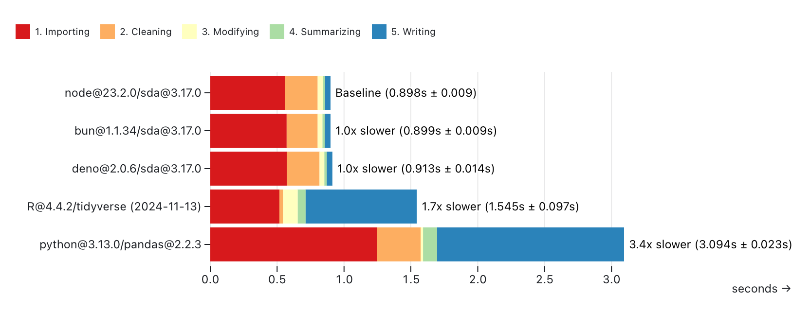
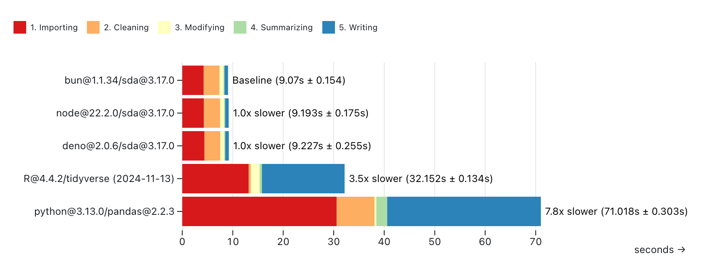
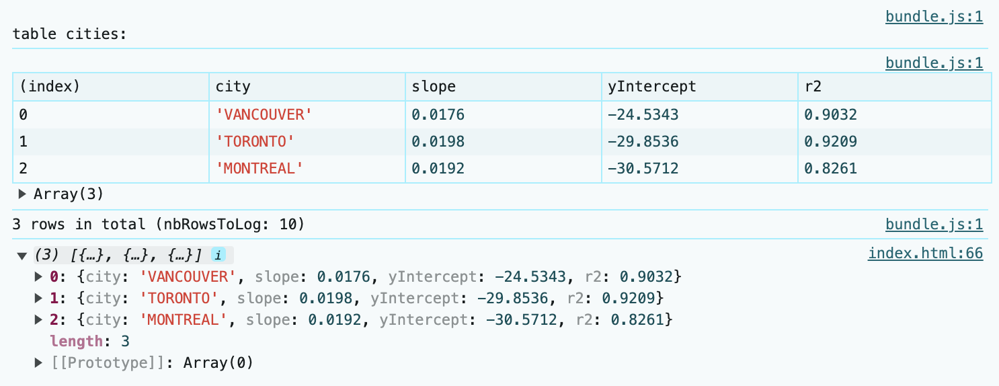
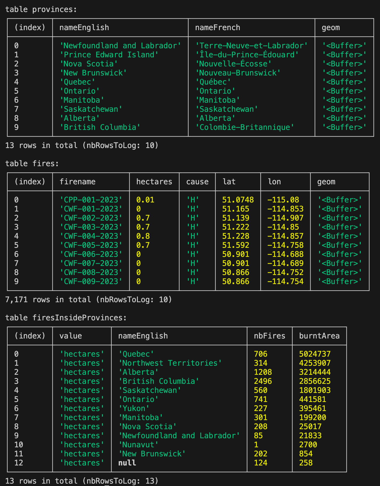

# Simple data analysis (SDA) in JavaScript

SDA is an easy-to-use and high-performance JavaScript library for data analysis. You can use it with tabular and geospatial data.

The library is maintained by [Nael Shiab](http://naelshiab.com/), computational journalist and senior data producer for [CBC News](https://www.cbc.ca/news).

To install with NPM:

```
npm i simple-data-analysis
```

With Bun:

```
bun add simple-data-analysis
```

The documentation is available [here](https://nshiab.github.io/simple-data-analysis/).

Make sure to check the section [Tips to work efficiently with SDA](#tips-to-work-efficiently-with-SDA).

Tests are run for NodeJS and Bun. Deno is coming! :)

You might also find the [journalism library](https://github.com/nshiab/journalism) and [Code Like a Journalist](https://github.com/nshiab/code-like-a-journalist) interesting.

## Core principles

SDA is born out of the frustration of switching between Python, R, and JavaScript to produce data journalism projects. Usually, data crunching and analysis are done with Python or R, and interactive data visualizations are coded in JavaScript. However, being proficient in multiple programming languages is hard. Why can't we do everything in JS?

The missing piece in the JavaScript/TypeScript ecosystem was an easy-to-use and performant library for data analysis. This is why SDA was created.

The library is based on [DuckDB](https://duckdb.org/), a fast in-process analytical database. Under the hood, SDA sends SQL queries to be executed by DuckDB. We use [duckdb-node](https://github.com/duckdb/duckdb-node) and [duckdb-wasm](https://github.com/duckdb/duckdb-wasm). This means SDA can run in the browser and with NodeJS and other runtimes. For geospatial computations, we rely on the [duckdb_spatial](https://github.com/duckdb/duckdb_spatial) extension.

The syntax and the available methods were inspired by [Pandas](https://github.com/pandas-dev/pandas) (Python) and the [Tidyverse](https://www.tidyverse.org/) (R).

You can also write your own SQL queries if you want to (check the [customQuery method](https://nshiab.github.io/simple-data-analysis/classes/SimpleWebDB.html#customQuery)) or use JavaScript to process your data (check the [updateWithJS method](https://nshiab.github.io/simple-data-analysis/classes/SimpleWebTable.html#updateWithJS)).

Feel free to start a conversation or open an issue. Check how you can [contribute](https://github.com/nshiab/simple-data-analysis/blob/main/CONTRIBUTING.md).

## Performance

To test and compare the library's performance, we calculated the average temperature per decade and city with the daily temperatures from the [Adjusted and Homogenized Canadian Climate Data](https://api.weather.gc.ca/collections/ahccd-annual). See [this repository](https://github.com/nshiab/simple-data-analysis-benchmarks) for the code.

We ran the same calculations with **simple-data-analysis@3.0.0** (both NodeJS and Bun), **Pandas (Python)**, and the **tidyverse (R)**.

In each script, we:

1. Loaded a CSV file (_Importing_)
2. Selected four columns, removed rows with missing temperature, converted date strings to date and temperature strings to float (_Cleaning_)
3. Added a new column _decade_ and calculated the decade (_Modifying_)
4. Calculated the average temperature per decade and city (_Summarizing_)
5. Wrote the cleaned-up data that we computed the averages from in a new CSV file (_Writing_)

Each script has been run ten times on a MacBook Pro (Apple M1 Pro / 16 GB).

### Small file

With _ahccd-samples.csv_:

-   74.7 MB
-   19 cities
-   20 columns
-   971,804 rows
-   19,436,080 data points

**simple-data-analysis@3.0.0** is the fastest, but if we skip writing the CSV file, the **tidyverse** shows impressive speed with small files.



### Big file

With _ahccd.csv_:

-   1.7 GB
-   773 cities
-   20 columns
-   22,051,025 rows
-   441,020,500 data points

Thanks to DuckDB, **simple-data-analysis@3.0.0** really shines with big files. It's the fastest option.



We also tried the One Billion Row Challenge, which involves computing the min, mean, and max temperatures for hundreds of cities in a 1,000,000,000 rows CSV file. The library has been able to crunch the numbers in 1 minute 32 seconds on the same computer (Apple M1 Pro / 16 GB). For more, check this [repo](https://github.com/nshiab/1brc) forked from this [one](https://github.com/gunnarmorling/1brc). The JavaScript code is [here](https://github.com/nshiab/1brc/blob/main/index.js).

Note that DuckDB, which powers SDA, can also be used with [Python](https://duckdb.org/docs/api/python/overview.html) and [R](https://duckdb.org/docs/api/r).

## SDA in an Observable notebook

Observable notebooks are great for data analysis in JavaScript.

In this [example](https://observablehq.com/@nshiab/hello-simple-data-analysis?collection=@nshiab/simple-data-analysis-in-javascript), we calculate the average temperature per decade in three cities and check for trends. We will also join two tables to retrieve the names of the cities.

This [other example](https://observablehq.com/@nshiab/hello-simple-data-analysis-and-geospatial-data?collection=@nshiab/simple-data-analysis-in-javascript) focuses on geospatial analysis. We create point geometries from the latitude and longitude of 2023 wildfires in Canada, do a spatial join with provinces' boundaries, and then compute the number of fires and the total area burnt per province.

## SDA in an HTML page

If you want to add the library directly to your webpage, you can use a npm-based CDN like jsDelivr.

Here's some code you can copy and paste into an HTML file.

In this example, we load a CSV file with the latitude and longitude of 2023 wildfires in Canada, create point geometries from it, do a spatial join with provinces boundaries, and then compute the number of fires and the total area burnt per province.

You could also use a framework or a bundler. Install the library with npm `npm i simple-data-analysis` and import it into your project `import { SimpleWebDB } from 'simple-data-analysis'`.

```html
<script type="module">
    // We import the SimpleWebDB class from the esm bundle.
    import { SimpleWebDB } from "https://cdn.jsdelivr.net/npm/simple-data-analysis@3.0.0/+esm"

    async function main() {
        // We start a SimpleWebDB instance.
        const sdb = new SimpleWebDB()

        // We create a new table.
        const provinces = sdb.newTable("provinces")
        // We fetch the provinces' boundaries. It's a geoJSON.
        await provinces.fetchGeoData(
            "https://raw.githubusercontent.com/nshiab/simple-data-analysis/main/test/geodata/files/CanadianProvincesAndTerritories.json"
        )
        // We log the provinces.
        await provinces.logTable()

        // We create a new table.
        const fires = sdb.newTable("fires")
        // We fetch the wildfires data. It's a CSV.
        await fires.fetchData(
            "https://raw.githubusercontent.com/nshiab/simple-data-analysis/main/test/geodata/files/firesCanada2023.csv"
        )
        // We create point geometries from the lat and lon columns
        // and we store the points in the new column geom.
        await fires.points("lat", "lon", "geom")
        // We log the fires
        await fires.logTable()

        // We match fires with provinces
        // and we output the results into a new table.
        // By default, joinGeo will automatically look
        // for columns storing geometries in the tables,
        // do a left join, and put the results
        // in the left table.
        const firesInsideProvinces = await fires.joinGeo(provinces, "inside", {
            outputTable: "firesInsideProvinces",
        })

        // We summarize to count the number of fires
        // and sum up the area burnt in each province.
        await firesInsideProvinces.summarize({
            values: "hectares",
            categories: "nameEnglish",
            summaries: ["count", "sum"],
            decimals: 0,
        })
        // We rename columns.
        await firesInsideProvinces.renameColumns({
            count: "nbFires",
            sum: "burntArea",
        })
        // We want the province with
        // the greatest burnt area first.
        await firesInsideProvinces.sort({ burntArea: "desc" })

        // We log the results. By default, the method
        // logs the first 10 rows, but there are 13
        // provinces and territories in Canada.
        await firesInsideProvinces.logTable(13)

        // We can also retrieve the data as an array of objects.
        const data = await firesInsideProvinces.getData()
        console.log(data)

        // We close everything.
        await sdb.done()
    }

    main()
</script>
```

And here's what you'll see in your browser's console tab.



## SDA with NodeJS and similar runtimes

First, ensure that you have [NodeJS v20 or higher](https://nodejs.org/en/) installed.

Then, run this command to install the library in your code repository.

With npm:

```bash
npm i simple-data-analysis
```

With bun:

```bash
bun add simple-data-analysis
```

A _package.json_ file should have been created. Open it and add or change the type to "module" to use a modern syntax. If you use Bun, you can skip this step.

```json
{
    "type": "module",
    "dependencies": {
        "simple-data-analysis": "^3.x.x"
    }
}
```

Copy and paste the code below into an `index.js` file and run it with `node index.js`.

In this example, we load a CSV file with the latitude and longitude of 2023 wildfires in Canada, create point geometries from it, do a spatial join with provinces' boundaries, and then compute the number of fires and the total area burnt per province.

It's the same code as the one you would run in a browser, except we use the _SimpleDB_ class instead of _SimpleWebDB_ and _loadData_ instead of _fetchData_.

With NodeJS and other runtimes, more methods are available to load and write data from/to local files. Check the [SimpleTable class documentation](https://nshiab.github.io/simple-data-analysis/classes/SimpleTable.html).

```ts
import { SimpleDB } from "simple-data-analysis"

// We start a SimpleDB instance.
const sdb = new SimpleDB()

// We create a new table.
const provinces = sdb.newTable("provinces")
// We fetch the provinces' boundaries. It's a geoJSON.
await provinces.loadGeoData(
    "https://raw.githubusercontent.com/nshiab/simple-data-analysis/main/test/geodata/files/CanadianProvincesAndTerritories.json"
)
// We log the provinces.
await provinces.logTable()

// We create a new table.
const fires = sdb.newTable("fires")
// We fetch the wildfires data. It's a CSV.
await fires.loadData(
    "https://raw.githubusercontent.com/nshiab/simple-data-analysis/main/test/geodata/files/firesCanada2023.csv"
)
// We create point geometries from the lat and lon columns
// and we store the points in the new column geom.
await fires.points("lat", "lon", "geom")
// We log the fires.
await fires.logTable()

// We match fires with provinces
// and we output the results into a new table.
// By default, joinGeo will automatically look
// for columns storing geometries in the tables,
// do a left join, and put the results
// in the left table.
const firesInsideProvinces = await fires.joinGeo(provinces, "inside", {
    outputTable: "firesInsideProvinces",
})

// We summarize to count the number of fires
// and sum up the area burnt in each province.
await firesInsideProvinces.summarize({
    values: "hectares",
    categories: "nameEnglish",
    summaries: ["count", "sum"],
    decimals: 0,
})
// We rename columns.
await firesInsideProvinces.renameColumns({
    count: "nbFires",
    sum: "burntArea",
})
// We want the province with
// the greatest burnt area first.
await firesInsideProvinces.sort({ burntArea: "desc" })

// We log the results. By default, the method
// logs the first 10 rows, but there are 13
// provinces and territories in Canada.
await firesInsideProvinces.logTable(13)

// We close everything.
await sdb.done()
```

And here's what you should see in your console.



## Tips to work efficiently with SDA

### Prettify your files

If you use [VS Code](https://code.visualstudio.com/) as your code editor, enable the `Format On Save` option. Every time you save your files (shortcut is `CMD + S` on Mac and `CTRL + S` on Windows), your files will be formatted, making them more organized and easier to read.

You can install the [Prettier extension](https://marketplace.visualstudio.com/items?itemName=esbenp.prettier-vscode) for more options.


If you use VS Code, the editor will try to show you the whole table in your terminal tabs. However, with wide tables, rows sometimes wrap onto the following line, making the tables unreadable. When this happens, use the shortcut `ALT + Z` to disable/enable the `editor.wordWrap` option. When disabled, the tables will overflow on the right side of your terminal, as expected.

### Watch your files

Instead of running your code manually every time you make a change, use the `--watch` flags like this:

-   With NodeJS: `node --watch index.js`
-   With Bun: `bun --watch index.js`

When this flag is enabled, `index.js` will be rerun anytime you save a change to it or to any of its dependencies.

### Caching fetched and computed data

Instead of running the same code over and over again, you can cache the results. Combined with the `--watch` flag, this can speed up your workflow, especially when fetching data or performing computationally expensive operations.

Here's the previous example adapted to cache data. For more information, check the [cache method documentation](https://nshiab.github.io/simple-data-analysis/classes/SimpleTable.html#cache).

The data is cached in the hidden folder `.sda-cache` at the root of your code repository. Make sure to add it to your `.gitignore` if you have one. If you want to clean your cache, just delete the folder.

```ts
import { SimpleDB } from "simple-data-analysis"

// We enable two options to make our lives easier.
// cacheVerbose will log information about the cached
// data, and logDuration will log the total duration between
// the creation of this SimpleDB instance and its last operation.
const sdb = new SimpleDB({ cacheVerbose: true, logDuration: true })

const fires = sdb.newTable("fires")

// We cache these steps with a ttl of 60 seconds.
// On the first run, the data will be fetched
// and stored in the hidden folder .sda-cache.
// If you rerun the script less than 60 seconds
// later, the data won't be fetched but loaded
// from the local cache. However, if you run the
// code after 60 seconds, the data will be
// considered outdated and fetched again.
// After another 60 seconds, the new data in the cache will
// expire again. This is useful when working with scraped data.
// If you update the code passed to the cache method,
// everything starts over.
await fires.cache(
    async () => {
        await fires.loadData(
            "https://raw.githubusercontent.com/nshiab/simple-data-analysis/main/test/geodata/files/firesCanada2023.csv"
        )
        await fires.points("lat", "lon", "geom")
    },
    { ttl: 60 }
)

const provinces = sdb.newTable("provinces")

// Same thing here, except there is no ttl option,
// so the cached data will never expire unless you delete
// the hidden folder .sda-cache. Again, if you update
// the code passed to the cache method, everything
// starts over.
await provinces.cache(async () => {
    await provinces.loadGeoData(
        "https://raw.githubusercontent.com/nshiab/simple-data-analysis/main/test/geodata/files/CanadianProvincesAndTerritories.json"
    )
})

const firesInsideProvinces = sdb.newTable("firesInsideProvinces")

// While caching is quite useful when fetching data,
// it's also handy for computationally expensive
// operations like joins and summaries.
// Since the fires table has a ttl of 60 seconds
// and we depend on it here, we need a ttl equal
// or lower. Otherwise, we won't work with
// up-to-date data.
await firesInsideProvinces.cache(
    async () => {
        await fires.joinGeo(provinces, "inside", {
            outputTable: "firesInsideProvinces",
        })
        await firesInsideProvinces.summarize({
            values: "hectares",
            categories: "nameEnglish",
            summaries: ["count", "sum"],
            decimals: 0,
        })
        await firesInsideProvinces.renameColumns({
            count: "nbFires",
            sum: "burntArea",
        })
        await firesInsideProvinces.sort({ burntArea: "desc" })
    },
    { ttl: 60 }
)

await firesInsideProvinces.logTable(13)

// It's important to call done() at the end.
// This method will remove the unused files
// in the cache. It will also log the total duration
// if the logDuration option was set to true.
await sdb.done()
```

After the first run, here's what you'll see in your terminal. For each `cache()`, a file storing the results has been written in `.sda-cache`.

The whole script took around a second to complete.

```
Nothing in cache. Running and storing in cache.
Duration: 311 ms. Wrote ./.sda-cache/fires.ff...68f.geojson.

Nothing in cache. Running and storing in cache.
Duration: 397 ms. Wrote ./.sda-cache/provinces.42...55.geojson.

Nothing in cache. Running and storing in cache.
Duration: 49 ms. Wrote ./.sda-cache/firesInsideProvinces.71...a8.parquet.

table firesInsideProvinces:
┌─────────┬────────────┬─────────────────────────────┬─────────┬───────────┐
│ (index) │ value      │ nameEnglish                 │ nbFires │ burntArea │
├─────────┼────────────┼─────────────────────────────┼─────────┼───────────┤
│ 0       │ 'hectares' │ 'Quebec'                    │ 706     │ 5024737   │
│ 1       │ 'hectares' │ 'Northwest Territories'     │ 314     │ 4253907   │
│ 2       │ 'hectares' │ 'Alberta'                   │ 1208    │ 3214444   │
│ 3       │ 'hectares' │ 'British Columbia'          │ 2496    │ 2856625   │
│ 4       │ 'hectares' │ 'Saskatchewan'              │ 560     │ 1801903   │
│ 5       │ 'hectares' │ 'Ontario'                   │ 741     │ 441581    │
│ 6       │ 'hectares' │ 'Yukon'                     │ 227     │ 395461    │
│ 7       │ 'hectares' │ 'Manitoba'                  │ 301     │ 199200    │
│ 8       │ 'hectares' │ 'Nova Scotia'               │ 208     │ 25017     │
│ 9       │ 'hectares' │ 'Newfoundland and Labrador' │ 85      │ 21833     │
│ 10      │ 'hectares' │ 'Nunavut'                   │ 1       │ 2700      │
│ 11      │ 'hectares' │ 'New Brunswick'             │ 202     │ 854       │
│ 12      │ 'hectares' │ null                        │ 124     │ 258       │
└─────────┴────────────┴─────────────────────────────┴─────────┴───────────┘
13 rows in total (nbRowsToLog: 13)

SimpleDB - Done in 891 ms
```

If you run the script less than 60 seconds after the first run, here's what you'll see.

Thanks to caching, the script ran five times faster!

```
Found ./.sda-cache/fires.ff...8f.geojson in cache.
ttl of 60 sec has not expired. The creation date is July 5, 2024, at 4:25 p.m.. There is 11 sec, 491 ms left.
Data loaded in 151 ms. Running the computations took 311 ms last time. You saved 160 ms.

Found ./.sda-cache/provinces.42...55.geojson in cache.
Data loaded in 8 ms. Running the computations took 397 ms last time. You saved 389 ms.

Found ./.sda-cache/firesInsideProvinces.71...a8.parquet in cache.
ttl of 60 sec has not expired. The creation date is July 5, 2024, at 4:25 p.m.. There is 11 sec, 792 ms left.
Data loaded in 1 ms. Running the computations took 49 ms last time. You saved 48 ms.

table firesInsideProvinces:
┌─────────┬────────────┬─────────────────────────────┬─────────┬───────────┐
│ (index) │ value      │ nameEnglish                 │ nbFires │ burntArea │
├─────────┼────────────┼─────────────────────────────┼─────────┼───────────┤
│ 0       │ 'hectares' │ 'Quebec'                    │ 706     │ 5024737   │
│ 1       │ 'hectares' │ 'Northwest Territories'     │ 314     │ 4253907   │
│ 2       │ 'hectares' │ 'Alberta'                   │ 1208    │ 3214444   │
│ 3       │ 'hectares' │ 'British Columbia'          │ 2496    │ 2856625   │
│ 4       │ 'hectares' │ 'Saskatchewan'              │ 560     │ 1801903   │
│ 5       │ 'hectares' │ 'Ontario'                   │ 741     │ 441581    │
│ 6       │ 'hectares' │ 'Yukon'                     │ 227     │ 395461    │
│ 7       │ 'hectares' │ 'Manitoba'                  │ 301     │ 199200    │
│ 8       │ 'hectares' │ 'Nova Scotia'               │ 208     │ 25017     │
│ 9       │ 'hectares' │ 'Newfoundland and Labrador' │ 85      │ 21833     │
│ 10      │ 'hectares' │ 'Nunavut'                   │ 1       │ 2700      │
│ 11      │ 'hectares' │ 'New Brunswick'             │ 202     │ 854       │
│ 12      │ 'hectares' │ null                        │ 124     │ 258       │
└─────────┴────────────┴─────────────────────────────┴─────────┴───────────┘
13 rows in total (nbRowsToLog: 13)

SimpleDB - Done in 184 ms
```

And if you run the script 60 seconds later, the fires and join/summary caches will have expired, but not the provinces one. Some of the code will have run, but not everything. The script still ran 1.5 times faster. This is quite handy in complex analysis with big datasets. The less you wait, the more fun you have!

```
Found ./.sda-cache/fires.ff...8f.geojson in cache
ttl of 60 sec has expired. The creation date is July 5, 2024, at 4:25 p.m.. It's is 4 min, 1 sec, 172 ms ago.
Running and storing in cache.
Duration: 424 ms. Wrote ./.sda-cache/fires.ff...8f.geojson.

Found ./.sda-cache/provinces.42...55.geojson in cache.
Data loaded in 10 ms. Running the computations took 397 ms last time. You saved 387 ms.

Fond ./.sda-cache/firesInsideProvinces.71...a8.parquet in cache
ttl of 60 sec has expired. The creation date is July 5, 2024, at 4:25 p.m.. It's is 4 min, 1 sec, 239 ms ago.
Running and storing in cache.
Duration: 42 ms. Wrote ./.sda-cache/firesInsideProvinces.71...a8.parquet.

table firesInsideProvinces:
┌─────────┬────────────┬─────────────────────────────┬─────────┬───────────┐
│ (index) │ value      │ nameEnglish                 │ nbFires │ burntArea │
├─────────┼────────────┼─────────────────────────────┼─────────┼───────────┤
│ 0       │ 'hectares' │ 'Quebec'                    │ 706     │ 5024737   │
│ 1       │ 'hectares' │ 'Northwest Territories'     │ 314     │ 4253907   │
│ 2       │ 'hectares' │ 'Alberta'                   │ 1208    │ 3214444   │
│ 3       │ 'hectares' │ 'British Columbia'          │ 2496    │ 2856625   │
│ 4       │ 'hectares' │ 'Saskatchewan'              │ 560     │ 1801903   │
│ 5       │ 'hectares' │ 'Ontario'                   │ 741     │ 441581    │
│ 6       │ 'hectares' │ 'Yukon'                     │ 227     │ 395461    │
│ 7       │ 'hectares' │ 'Manitoba'                  │ 301     │ 199200    │
│ 8       │ 'hectares' │ 'Nova Scotia'               │ 208     │ 25017     │
│ 9       │ 'hectares' │ 'Newfoundland and Labrador' │ 85      │ 21833     │
│ 10      │ 'hectares' │ 'Nunavut'                   │ 1       │ 2700      │
│ 11      │ 'hectares' │ 'New Brunswick'             │ 202     │ 854       │
│ 12      │ 'hectares' │ null                        │ 124     │ 258       │
└─────────┴────────────┴─────────────────────────────┴─────────┴───────────┘
13 rows in total (nbRowsToLog: 13)

SimpleDB - Done in 594 ms
```

### Others

If you want to generate and save charts with NodeJS and other runtimes, check the [journalism library](https://github.com/nshiab/journalism), more specifically the [savePlotChart function](https://nshiab.github.io/journalism/functions/savePlotChart.html).
