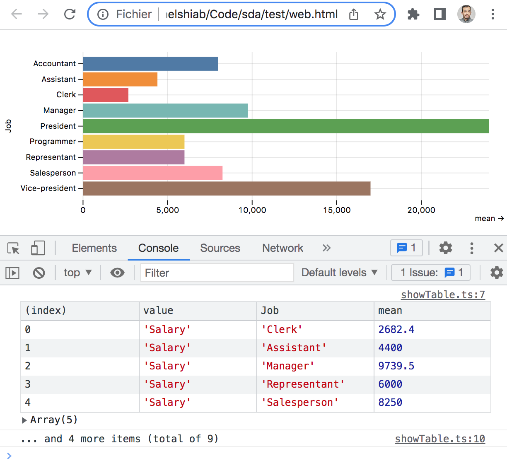
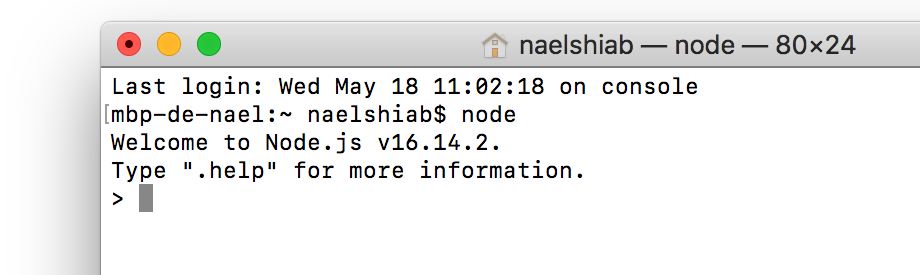
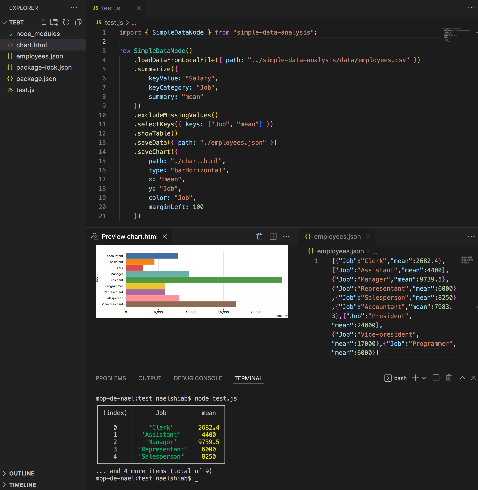

# Simple data analysis

This repository is maintained by [Nael Shiab](http://naelshiab.com/), senior data producer, and [Isabelle Bouchard](https://github.com/isabellebouchard), data scientist, both working at [CBC/Radio-Canada](https://cbc.radio-canada.ca/).

These project's goals are:

- To ease the way for non-coders (especially journalists) into the beautiful world of data analysis and data visualization in JavaScript.

- To uniformize and accelerate frontend/backend workflows with a simple to use library working both in the browser and with NodeJS.

We are always trying to improve it. Feel free to start a conversation or open an issue. Pull requests are welcome as well!

A demo is available here: https://observablehq.com/@nshiab/simple-data-analysis

# Table of contents

1. [Core principles](#core-principles)
2. [Easiest way to use](#the-easiest-way-to-use-the-library)
3. [Simple example from the HTML](#simple-example-from-the-html)
4. [NodeJS and JavaScript bundlers](#working-with-nodejs-and-javascript-bundlers)
5. [SimpleData](#simpledata)
6. [SimpleDataNode](#simpledatanode)
7. [SimpleDocument (experimental)](#simpledocument-experimental-for-nodejs-only)
8. [All functions and methods](#all-functions-and-methods)

## Core principles

Under the hood, simple-data-analysis is mainly based on [D3 modules](https://github.com/d3/d3) and [Observable Plot](https://github.com/observablehq/plot). The main focus is on providing code that is easy to use and understand.

The library expects **tabular data** stored in CSV files or **arrays of objects** stored in JSON files. It works best when the data is tidy:

1. Every column (or key) is a variable

2. Every row (or item) is an observation

3. Every cell (or value) is a single value

For more about tidy data, you can read [this great article](https://cran.r-project.org/web/packages/tidyr/vignettes/tidy-data.html).


## The easiest way to use the library

If you don't want to install anything, a great platform is Observable. Check this demo of the library in an [Observable's notebook](https://observablehq.com/@nshiab/simple-data-analysis).


## Simple example from the HTML

If you want to add the library directly to your webpage, you can use the UMD minified bundle and call **sda**.

Here's an example.

```js
<script src="https://cdn.jsdelivr.net/npm/simple-data-analysis@latest/dist/simple-data-analysis.min.js">
</script>

<div id="viz"></div>

<script>
    async function main() {

        const simpleData = await new sda.SimpleData()
            // We retrieve some data
            .loadDataFromUrl({
                url: "https://raw.githubusercontent.com/nshiab/simple-data-analysis/main/data/employees.csv"
            })

        simpleData
            // We compute the mean of
            // the salaries for each job
            .summarize({
                keyValue: "Salary",
                keyCategory: "Job",
                summary: "mean"
            })
            // We remove items with missing values
            .excludeMissingValues()
            // We log the table in the console
            .showTable()

        // We select our div with the id "viz"
        // and we push a chart in it.
        document.querySelector("#viz").innerHTML =
            simpleData
                // getChart() returns SVG
                // or HTML elements
                .getChart({
                    x: "mean",
                    y: "Job",
                    color: "Job",
                    type: "barHorizontal",
                    marginLeft: 100
                })
    }

    main()
</script>
```

And here's the result in the browser!




## Working with NodeJS and JavaScript Bundlers

First, make sure that your NodeJS version is 16 or higher. To check it, write ```node``` in your terminal and press Enter.

You should see something like this.


If the version is less than 16, update [NodeJS with the latest LTS (long-term support) version](https://nodejs.org/en/) .

With NodeJS installed, you have access to [npm](https://www.npmjs.com/package/simple-data-analysis). To install the library with npm, type this command in your terminal:
```
npm i simple-data-analysis
```

Once installed, you can import what you need. If you use a bundler (Webpack, Rollup, Parcel or others), importing only the required code will make your final project lighter.

**/!\ This is how you should import if you plan to publish your project on the web. /!\\**
```js
import { SimpleData } from "simple-data-analysis"

const someData = [...] // An array of objects

const simpleData = new SimpleData({ data: someData })
// You can also load data 
// from a local file or an url
```

But you can also import everything if you wish. Just keep in mind that your final build will be bigger.
```js
import * as sda from "simple-data-analysis"

const someData = [...] // An array of objects

const simpleData = new sda.SimpleData({ data: someData })
// Start chaining methods
```

## SimpleData

The SimpleData class is the core of the library. It allows you clean, analyze and visualize your data easily by chaining methods.

When you chain methods, the data is updated at each step and sent to the next one.

For a description of all methods available, check this [Observable notebook](https://observablehq.com/@nshiab/simple-data-analysis).

## SimpleDataNode

If you use the library with NodeJS, you can import SimpleDataNode instead of SimpleData. It will give you extra methods to load local files, save files and save charts.

Here's an example.

```js
import { SimpleDataNode } from "simple-data-analysis";

new SimpleDataNode()
    .loadDataFromLocalFile({
        path: "../simple-data-analysis/data/employees.csv"
    })
    // You can load json files as well
    .summarize({
        keyValue: "Salary",
        keyCategory: "Job",
        summary: "mean"
    })
    .excludeMissingValues()
    .selectKeys({ keys: ["Job", "mean"] })
    .showTable()
    .saveData({ path: "./employees.json" })
    // You can save csv files as well
    .saveChart({
        path: "./chart.html",
        type: "barHorizontal",
        x: "mean",
        y: "Job",
        color: "Job",
        marginLeft: 100
    })
    // You need to save the charts
    // as HTML files.
```

And here's the result in VS Code!



## SimpleDocument (experimental, for NodeJS only)

While working on your analysis, it's sometimes helpful to build a document that you'll be able to share with your results.

The SimpleDocument allows you to do that. You can pass JSX expressions, React components and SVG to it, and it will render everything as an HTML file or React component.

Note that this class is still under heavy development.

```js
import React from "react"
import {SimpleData, SimpleDocument, Table} from "simple-data-analysis"
import { Typography } from "@mui/material"

const someData = [...]
// Let's say it's some employees information again.

const simpleData = new SimpleData({data: someData})
// or SimpleDataNode

const simpleDocument = new SimpleDocument()

simpleDocument
    .add(<h1>Some JSX!</h1>)
    .add(<Typography>
        An MUI component!
    </Typography>)
    .add(<Table
        keys={simpleData.getKeys()}
        data={simpleData.getData()}
    />)
    .add(simpleData.getChart({
        type: "dot",
        x: "job",
        y: "salary",
        color: "union"
    }))
    .saveDocument('somePath/analysis.html')
    .saveDocument('somePath/AnalysisComponent.js')
    // saveDocument use ReactDOMServer.renderToString
    // on everything that has been added

```

## All functions and methods

For a description of all methods and how to use them, check this Observable notebook: https://observablehq.com/@nshiab/simple-data-analysis