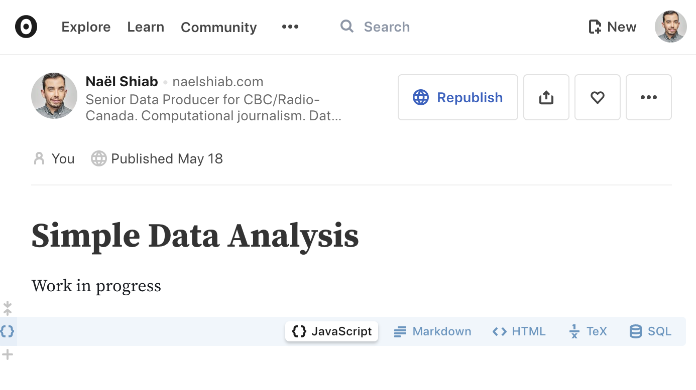

# Simple data analysis

These project's goals are:

- To ease the way for non-coders (especially journalists) into the beautiful world of data analysis and data visualization in JavaScript.

- To uniformize and accelerate frontend/backend workflows with a simple to use library working both in the browser and with NodeJS.

We are always trying to improve it. Feel free to start a conversation or open an issue. Pull requests are welcome as well!

## Core principles

The library expects **tabular data** stored in CSV files or **arrays of objects** stored in JSON files. It works best when the data is tidy:

1. Every column (or key) is a variable

2. Every row (or item) is an observation

3. Every cell (or value) is a single value

## The easiest way to use the library

If you don't want to install anything, a great platform is Observable. Here's how to use the library inside an [Observable's notebook](https://observablehq.com/@nshiab/simple-data-analysis).



## Importing from the HTML

If you want to add the library directly to your webpage, you can use the UMD minified bundle. Call **sda** to have access to the functions.

```js
<script src="https://cdn.jsdelivr.net/npm/simple-data-analysis@latest"></script>

<script>

const someData = [
    {firstName: "Nael", lastName: "Shiab", job: "Computational journalist"},
    {firstName: "Isabelle", lastName: "Bouchard", job: "Data scientist"}
]

const simpleData = sda.createSimpleData(someData)

</script>
```
## Working with NodeJS / JavaScript Bundlers

First, make sure that your NodeJS version is 16 or higher. To check, write ```node``` in your terminal and press Enter.

You should see something like this.


If the version is less than 16, update [NodeJS](https://nodejs.org/en/) with the latest LTS (long-term support) version.

To install the library with npm, type this command in your terminal:
```
npm i simple-data-analysis
```

Once installed, you can import the functions as needed. If you use a bundler (Webpack, Rollup, Parcel or others), importing only the required functions will make your final project lighter.

**/!\ This is how you should import the functions if you plan to publish your project on the web. /!\\**
```js
import {createSimpleData} from "simple-data-analysis"

const simpleData = createSimpleData(someData)
```

But you can also import everything if you wish.
```js
import * as sda from "simple-data-analysis"

const simpleData = sda.createSimpleData(someData)
```

## SimpleDocument (experimental, for NodeJS only)

While working on your analysis, it's sometimes helpful to build a document that you'll be able to share with your results.

The SimpleDocument allows you to do that. You can pass JSX expressions, React components and SVG to it and it will render everything as an HTML file or React component.

Note that this class is still under heavy development.

```js
import React from "react"
import {SimpleData, SimpleDocument, Table} from "simple-data-analysis"
import { Typography } from "@mui/material"

const simpleData = new SimpleData(someData)

const simpleDocument = new SimpleDocument()

simpleDocument
    .add(<h1>Some JSX!</h1>)
    .add(<Typography>An MUI component!</Typography>)
    .add(<Table keys={simpleData.keys} data={simpleData.data} />)
    .add(simpleData.createChart("dot", "variableX", "variableY", "variableColor"))
    .saveDocument('somePath/analysis.html')
    .saveDocument('somePath/AnalysisComponent.js')

```

## All functions and methods available

TODO