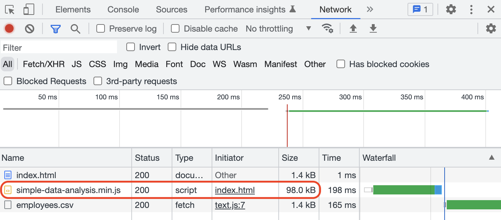
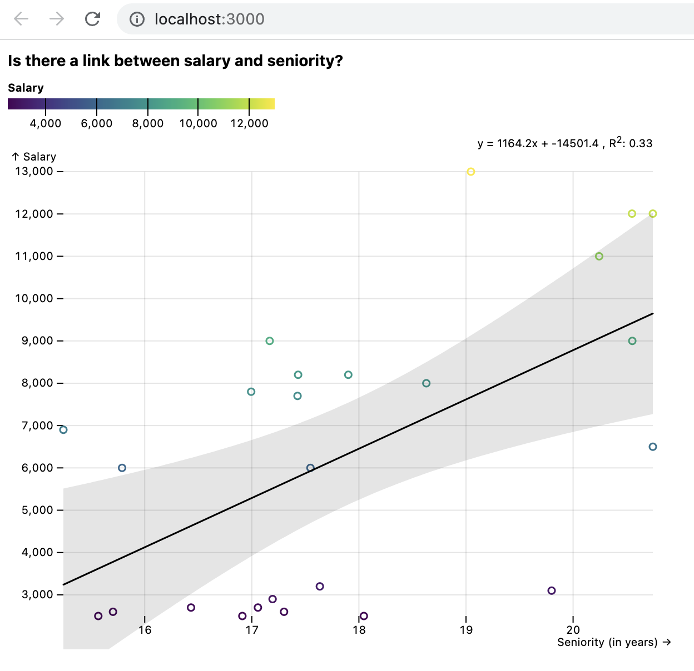

# Simple data analysis (SDA)

This repository is maintained by [Nael Shiab](http://naelshiab.com/), senior data producer at [CBC/Radio-Canada](https://cbc.radio-canada.ca/).

If you use the library, show off your work and tag me on [Twitter](https://twitter.com/NaelShiab) or [LinkedIn](https://www.linkedin.com/in/naelshiab/)! :)

These project's goals are:

- To ease the way for non-coders (especially journalists) into the beautiful world of data analysis and data visualization in JavaScript.

- To standardize and accelerate frontend/backend workflows with a simple-to-use library working both in the browser and with NodeJS.

We are always trying to improve it. Feel free to start a conversation or open an issue, and check [how you can contribute](https://github.com/nshiab/simple-data-analysis/blob/main/CONTRIBUTING.md).

The documentation is available [here](https://nshiab.github.io/simple-data-analysis/) and more demos [here](https://observablehq.com/@nshiab/simple-data-analysis?collection=@nshiab/simple-data-analysis-in-javascript).

# Table of contents

1. [Core principles](#core-principles)
2. [Easiest way to use](#the-easiest-way-to-use-the-library)
3. [Simple example from the HTML](#simple-example-from-the-html)
4. [NodeJS and JavaScript bundlers](#working-with-nodejs-and-javascript-bundlers)
5. [Using it with React](#using-it-with-react)
6. [SimpleData class](#simpledata-class)
7. [SimpleDataNode class](#simpledatanode-class)
8. [SimpleDocument class (experimental)](#simpledocument-class-experimental-for-nodejs-only)
9. [All functions and methods](#all-functions-and-methods)

## Core principles

Under the hood, SDA is mainly based on [D3 modules](https://github.com/d3/d3), [Observable Plot](https://github.com/observablehq/plot) and [Lodash](https://lodash.com/). The focus is on providing code that is easy to use and understand.

The library expects **tabular data** stored in CSV/TSV files or **arrays of objects** stored in JSON files. It works best when the data is tidy:

1. Every key (or column) is a variable

2. Every item (or row) is an observation

3. Every value (or cell) is a single value

For more about tidy data, you can read [this great article](https://cran.r-project.org/web/packages/tidyr/vignettes/tidy-data.html).


## The easiest way to use the library

If you don't want to install anything, a great platform is Observable. Check this demo of the library in an [Observable's notebook](https://observablehq.com/@nshiab/simple-data-analysis?collection=@nshiab/simple-data-analysis-in-javascript).


## Simple example from the HTML

If you want to add the library directly to your webpage, you can use the minified bundle from a npm-based CDN like jsDelivr and call **sda**.

Here's an example.

```js
<script src="https://cdn.jsdelivr.net/npm/simple-data-analysis@latest">
    // If you have a source map warning in the console,
    // you can use src="https://cdn.jsdelivr.net/npm/simple-data-analysis@latest/dist/simple-data-analysis.min.js"
</script>

<div id="viz"></div>

<script>
    async function main() {

        const simpleData = await new sda.SimpleData()
            // We retrieve some data
            .loadDataFromUrl({
                url: "https://raw.githubusercontent.com/nshiab/simple-data-analysis/main/data/employees.csv",
                autoType: true // CSV files are text. Automatically convert numbers.
            })

        simpleData
            // We remove duplicate items
            .removeDuplicates()
            // We compute the mean of
            // the salaries for each job
            .summarize({
                keyValue: "Salary",
                keyCategory: "Job",
                summary: "mean"
            })
            // We remove items with missing values
            .excludeMissingValues()
            // We log the table in the console
            .showTable()

        // We select our div with the id "viz"
        // and we add a chart in it.
        document.querySelector("#viz").innerHTML =
            simpleData
                // getChart() returns SVG
                // or HTML elements
                .getChart({
                    x: "mean",
                    y: "Job",
                    color: "Job",
                    type: "barHorizontal",
                    marginLeft: 100
                })
    }

    main()
</script>
```

And here's the result in the browser!


As you can see below, SDA is a lightweight library optimized for the web (98kb ≈ 12ko).



## Working with NodeJS and JavaScript Bundlers

First, make sure that your NodeJS version is 16 or higher. To check it, write ```node``` in your terminal and press Enter.

You should see something like this.


If the version is less than 16, update [NodeJS with the latest LTS (long-term support) version](https://nodejs.org/en/) .

To install the library with [npm](https://www.npmjs.com/package/simple-data-analysis), type this command in your terminal:
```
npm i simple-data-analysis
```

Once installed, you can import what you need.

```js
import { SimpleData } from "simple-data-analysis"

const someData = [...] // An array of objects

const simpleData = new SimpleData({ data: someData })
```

If you are using NodeJS and want to read or write local files, use SimpleDataNode instead.

```js
import { SimpleDataNode } from "simple-data-analysis"

const simpleData = new SimpleDataNode()
    .loadDataFromLocalFile({
        path: "./someFile.csv"
    })
```

## Using it with React

You can use SDA with React as well. Put the relevant code inside a useEffect or useMemo. The example below was created inside a [Next.js](https://nextjs.org/) app.

```js
import { useEffect, useRef } from "react"
import { SimpleData } from "simple-data-analysis"

export default function Home() {

  const ref = useRef()

  useEffect(() => {

    SimpleDataFromUrl()

    async function SimpleDataFromUrl() {

      const simpleData = await new SimpleData()
        .loadDataFromUrl({
            url: "https://raw.githubusercontent.com/nshiab/simple-data-analysis/main/data/employees.csv",
            autoType: true
        })

      ref.current.innerHTML =
      simpleData
        .getChart({
            x: "Departement or unit",
            y: "Salary",
            type: "dot",
            marginLeft: 50,
            trend: true,
            showTrendEquation: true
        })
    }
  }, [])

  return <div ref={ref}>
  </div>
}
```

Here's the result.



## SimpleData class

The SimpleData class is the core of the library. Chaining methods allow you to clean, analyze, and visualize your data easily.

When you chain methods, the data is updated at each step and sent to the next one.

You also have special properties to facilitate your work. If you create a SimpleData with verbose to true (like this `new SimpleDataNode({ verbose: true })`), extra information will be logged on the console at each step, like a table of your data. You can also log methods parameters with `logParameters: true`.

If, for some reason, you want to chain a method but not overwrite the data, you can pass `overwrite: false` to the method (like this `simpleData.summarize({ overwrite: false })`). The result of the method will be logged in the console (even if verbose is set to false), but the data passed to the next chained method will not be modified.

If you are curious about how much time everything took, you can use the showDuration method (like this `simpleData.showDuration()`) to log this information. After logging, this method returns the SimpleData instance, so you can chain it anywhere you want, just like the showTable method. If you want to retrieve the duration and put it inside a variable, use getDuration (like this `simpleData.getDuration()`) which will return this information in milliseconds.

For a description of all methods available, check this [Observable notebook](https://observablehq.com/@nshiab/simple-data-analysis?collection=@nshiab/simple-data-analysis-in-javascript) or the [automatically generated documentation](https://nshiab.github.io/simple-data-analysis/).

## SimpleDataNode class

If you use the library with NodeJS, you can import SimpleDataNode instead of SimpleData. It will give you extra methods to load local files, save files and save charts.

```js
import { SimpleDataNode } from "simple-data-analysis";

new SimpleDataNode()
    .loadDataFromLocalFile({
        path: "../simple-data-analysis/data/employees.csv",
        autoType: true
    })
    // You can load TSV and JSON files as well
    .summarize({
        keyValue: "Salary",
        keyCategory: "Job",
        summary: "mean"
    })
    .excludeMissingValues()
    .selectKeys({ keys: ["Job", "mean"] })
    .showTable()
    .saveData({ path: "./employees.json" })
    // You can save CSV and TSV files as well
    // When saving JSON files, you can restructure
    // the data as arrays by adding dataAsArrays : true
    .saveChart({
        path: "./chart.html",
        type: "barHorizontal",
        x: "mean",
        y: "Job",
        color: "Job",
        marginLeft: 100
    })
    // You need to save the charts
    // as HTML files.
```

And here's the result in VS Code!


## SimpleDocument class (experimental, for NodeJS only)

While working on your analysis, it's sometimes helpful to build a document that you'll be able to share with your results.

The SimpleDocument allows you to do that. You can pass JSX expressions, React components and SVG to it, and it will render everything as an HTML file or React component.

Note that this class is still under heavy development.

```js
import React from "react"
import {SimpleData, SimpleDocument, Table} from "simple-data-analysis"
import { Typography } from "@mui/material"

const someData = [...]
// Let's say it's some employees information again.

const simpleData = new SimpleData({data: someData})
// or SimpleDataNode

const simpleDocument = new SimpleDocument()

simpleDocument
    .add(<h1>Some JSX!</h1>)
    .add(<Typography>
        An MUI component!
    </Typography>)
    .add(<Table
        keys={simpleData.getKeys()}
        data={simpleData.getData()}
    />)
    .add(simpleData.getChart({
        type: "dot",
        x: "job",
        y: "salary",
        color: "union"
    }))
    .saveDocument('somePath/analysis.html')
    .saveDocument('somePath/AnalysisComponent.js')
    // saveDocument use ReactDOMServer.renderToString
    // on everything that has been added

```

## All functions and methods

The documentation is automatically generated with [TypeDoc](https://typedoc.org/) and available here: https://nshiab.github.io/simple-data-analysis/.

For a description of all methods and how to use them, you can also check this Observable notebook: https://observablehq.com/@nshiab/simple-data-analysis?collection=@nshiab/simple-data-analysis-in-javascript.