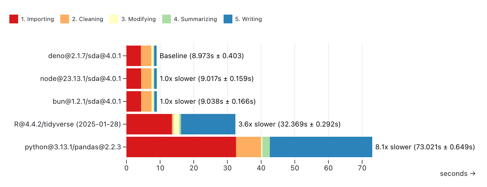

# Simple data analysis (SDA)

SDA is an easy-to-use and high-performance JavaScript library for data analysis.
You can use it with tabular and geospatial data.

The library is available on [JSR](https://jsr.io/@nshiab/simple-data-analysis)
with its [documentation](https://jsr.io/@nshiab/simple-data-analysis/doc).

The library is maintained by [Nael Shiab](http://naelshiab.com/), computational
journalist and senior data producer for [CBC News](https://www.cbc.ca/news).

To use the library in your browser, check out
[simple-data-analysis-flow](https://github.com/nshiab/simple-data-analysis-flow).
You might also find the
[journalism library](https://github.com/nshiab/journalism) and
[Code Like a Journalist](https://github.com/nshiab/code-like-a-journalist)
interesting.

If you wish to contribute, please check the
[guidelines](https://github.com/nshiab/simple-data-analysis/blob/main/CONTRIBUTING.md).

## Quick setup

Create a folder and run [setup-sda](https://github.com/nshiab/setup-sda) in it
with:

```bash
# Deno >= 2.x.x
deno -A jsr:@nshiab/setup-sda

# Node.js >= 22.6.x
npx setup-sda

# Bun
bunx --bun setup-sda
```

If you want to use SDA with [Svelte](https://svelte.dev/), pass the `--svelte`
flag:

```bash
# Deno >= 2.x.x
deno -A jsr:@nshiab/setup-sda --svelte

# Node.js >= 22.6.x
npx setup-sda --svelte

# Bun
bunx --bun setup-sda --svelte
```

If you want to use SDA with
[Framework](https://github.com/observablehq/framework), pass the `--framework`
flag.

To initialize a git repository in the folder, pass the `--git` flag.

## Manual installation

If you want to add the library to an existing project, run this:

```bash
# Deno >= 2.x.x
deno install --node-modules-dir=auto --allow-scripts=npm:playwright-chromium@1.50.0 jsr:@nshiab/simple-data-analysis
# To run with Deno
deno run --node-modules-dir=auto -A main.ts

# Node.js
npx jsr add @nshiab/simple-data-analysis

# Bun
bunx jsr add @nshiab/simple-data-analysis
```

## Core principles

SDA is born out of the frustration of switching between Python, R, and
JavaScript to produce data journalism projects. Usually, data crunching and
analysis are done with Python or R, and interactive data visualizations are
coded in JavaScript. However, being proficient in multiple programming languages
is hard. Why can't we do everything in JS?

The missing piece in the JavaScript/TypeScript ecosystem was an easy-to-use and
performant library for data analysis. This is why SDA was created.

The library is based on [DuckDB](https://duckdb.org/), a fast in-process
analytical database. Under the hood, SDA sends SQL queries to be executed by
DuckDB. We use [duckdb-node-neo](https://github.com/duckdb/duckdb-node-neo) and
[duckdb-wasm](https://github.com/duckdb/duckdb-wasm). This means SDA can run in
the browser and with Node.js and other runtimes. For geospatial computations, we
rely on the [duckdb_spatial](https://github.com/duckdb/duckdb_spatial)
extension.

The syntax and the available methods were inspired by
[Pandas](https://github.com/pandas-dev/pandas) (Python) and the
[Tidyverse](https://www.tidyverse.org/) (R).

You can also write your own SQL queries if you want to (check the
[customQuery method](https://nshiab.github.io/simple-data-analysis/classes/SimpleWebDB.html#customQuery))
or use JavaScript to process your data (check the
[updateWithJS method](https://nshiab.github.io/simple-data-analysis/classes/SimpleWebTable.html#updateWithJS)).

Feel free to start a conversation or open an issue. Check how you can
[contribute](https://github.com/nshiab/simple-data-analysis/blob/main/CONTRIBUTING.md).

## Performance

### Tabular data

To test and compare the library's performance, we calculated the average
temperature per decade and city with the daily temperatures from the
[Adjusted and Homogenized Canadian Climate Data](https://api.weather.gc.ca/collections/ahccd-annual).
See [this repository](https://github.com/nshiab/simple-data-analysis-benchmarks)
for the code.

We ran the same calculations with **simple-data-analysis@3.0.0** (Node.js, Bun,
and Deno), **Pandas (Python)**, and the **tidyverse (R)**.

In each script, we:

1. Loaded a CSV file (_Importing_)
2. Selected four columns, removed rows with missing temperature, converted date
   strings to date and temperature strings to float (_Cleaning_)
3. Added a new column _decade_ and calculated the decade (_Modifying_)
4. Calculated the average temperature per decade and city (_Summarizing_)
5. Wrote the cleaned-up data that we computed the averages from in a new CSV
   file (_Writing_)

Each script has been run ten times on a MacBook Pro (Apple M1 Pro / 16 GB).

With _ahccd.csv_:

- 1.7 GB
- 773 cities
- 20 columns
- 22,051,025 rows

Thanks to DuckDB, **simple-data-analysis** is the fastest option.



We also tried the One Billion Row Challenge, which involves computing the min,
mean, and max temperatures for hundreds of cities in a 1,000,000,000 rows CSV
file. The library has been able to crunch the numbers in 1 minute 32 seconds on
the same computer (Apple M1 Pro / 16 GB). For more, check this
[repo](https://github.com/nshiab/1brc) forked from this
[one](https://github.com/gunnarmorling/1brc). The JavaScript code is
[here](https://github.com/nshiab/1brc/blob/main/index.js).

### Geospatial data

To test the geospatial computation speed, we performed a spatial join to match
each public tree in Montreal to its neighbourhood. We then counted the number of
trees in each neighbourhood. For more information, check this
[repository](https://github.com/nshiab/simple-data-analysis-spatial-benchmarks).

With _trees.csv_:

- 128 MB
- 316,321 trees
- 33 columns

And _neighbourhoods.geojson_:

- 991 KB
- 91 neighbourhoods
- 6 columns

Each script has been run ten times on a MacBook Pro (Apple M1 Pro / 16 GB).

As we can see, **simple-data-analysis** is a bit slower than Python's GeoPandas
but faster than R's sf package. Note that the spatial extension for DuckDB is a
[work in progress](https://github.com/duckdb/duckdb_spatial).


DuckDB, which powers SDA, can also be used with
[Python](https://duckdb.org/docs/api/python/overview.html) and
[R](https://duckdb.org/docs/api/r).

## Example

In this example, we load a CSV file with the latitude and longitude of 2023
wildfires in Canada, create point geometries from it, do a spatial join with
provinces' boundaries, and then compute the number of fires and the total area
burnt per province.

If you are using Deno, make sure to install and enable the
[Deno extension](https://docs.deno.com/runtime/getting_started/setup_your_environment/).

```ts
import { SimpleDB } from "@nshiab/simple-data-analysis";

// We start a SimpleDB instance.
const sdb = new SimpleDB();

// We create a new table
const provinces = sdb.newTable("provinces");
// We fetch the provinces' boundaries. It's a geojson.
await provinces.loadGeoData(
  "https://raw.githubusercontent.com/nshiab/simple-data-analysis/main/test/geodata/files/CanadianProvincesAndTerritories.json",
);
// We log the provinces
await provinces.logTable();

// We create a new table
const fires = sdb.newTable("fires");
// We fetch the wildfires data. It's a csv.
await fires.loadData(
  "https://raw.githubusercontent.com/nshiab/simple-data-analysis/main/test/geodata/files/firesCanada2023.csv",
);
// We create point geometries from the lat and lon columns
// and we store the points in the new column geom
await fires.points("lat", "lon", "geom");
// We log the fires
await fires.logTable();

// We match fires with provinces
// and we output the results into a new table.
// By default, joinGeo will automatically look
// for columns storing geometries in the tables,
// do a left join, and put the results
// in the left table.
const firesInsideProvinces = await fires.joinGeo(provinces, "inside", {
  outputTable: "firesInsideProvinces",
});

// We summarize to count the number of fires
// and sum up the area burnt in each province.
await firesInsideProvinces.summarize({
  values: "hectares",
  categories: "nameEnglish",
  summaries: ["count", "sum"],
  decimals: 0,
});
// We rename columns.
await firesInsideProvinces.renameColumns({
  count: "nbFires",
  sum: "burntArea",
});
// We want the province with
// the greatest burnt area first.
await firesInsideProvinces.sort({ burntArea: "desc" });

// We log the results. By default, the method
// logs the first 10 rows, but there is 12
// provinces and territories in Canada
// with burnt areas, so we log 12 rows.
// We also log the data types.
await firesInsideProvinces.logTable({ nbRowsToLog: 12, logTypes: true });

// We can also log a bar chart directly in the terminal.
await firesInsideProvinces.logBarChart("nameEnglish", "burntArea");

// We close everything.
await sdb.done();
```

Here's what you should see in your console if your run this scripts.


## Caching fetched and computed data

Instead of running the same code over and over again, you can cache the results.
This can speed up your workflow, especially when fetching data or performing
computationally expensive operations.

Here's the previous example adapted to cache data. For more information, check
the
[cache method documentation](https://nshiab.github.io/simple-data-analysis/classes/SimpleTable.html#cache).

The data is cached in the hidden folder `.sda-cache` at the root of your code
repository. Make sure to add it to your `.gitignore`. If you want to clean your
cache, just delete the folder.

If you set up with `setup-sda` (see _Quick setup_ at the top), `.sda-cache` is
automatically added to your `.gitignore` and you can use `npm run clean` or
`bun run clean` or `deno task clean` to clear the cache.

```ts
import { SimpleDB } from "@nshiab/simple-data-analysis";

// We enable two options to make our lives easier.
// cacheVerbose will log information about the cached
// data, and logDuration will log the total duration between
// the creation of this SimpleDB instance and its last operation.
const sdb = new SimpleDB({ cacheVerbose: true, logDuration: true });

const fires = sdb.newTable("fires");

// We cache these steps with a ttl of 60 seconds.
// On the first run, the data will be fetched
// and stored in the hidden folder .sda-cache.
// If you rerun the script less than 60 seconds
// later, the data won't be fetched but loaded
// from the local cache. However, if you run the
// code after 60 seconds, the data will be
// considered outdated and fetched again.
// After another 60 seconds, the new data in the cache will
// expire again. This is useful when working with scraped data.
// If you update the code passed to the cache method,
// everything starts over.
await fires.cache(
  async () => {
    await fires.loadData(
      "https://raw.githubusercontent.com/nshiab/simple-data-analysis/main/test/geodata/files/firesCanada2023.csv",
    );
    await fires.points("lat", "lon", "geom");
  },
  { ttl: 60 },
);

const provinces = sdb.newTable("provinces");

// Same thing here, except there is no ttl option,
// so the cached data will never expire unless you delete
// the hidden folder .sda-cache. Again, if you update
// the code passed to the cache method, everything
// starts over.
await provinces.cache(async () => {
  await provinces.loadGeoData(
    "https://raw.githubusercontent.com/nshiab/simple-data-analysis/main/test/geodata/files/CanadianProvincesAndTerritories.json",
  );
});

const firesInsideProvinces = sdb.newTable("firesInsideProvinces");

// While caching is quite useful when fetching data,
// it's also handy for computationally expensive
// operations like joins and summaries.
// Since the fires table has a ttl of 60 seconds
// and we depend on it here, we need a ttl equal
// or lower. Otherwise, we won't work with
// up-to-date data.
await firesInsideProvinces.cache(
  async () => {
    await fires.joinGeo(provinces, "inside", {
      outputTable: "firesInsideProvinces",
    });
    await firesInsideProvinces.removeMissing();
    await firesInsideProvinces.summarize({
      values: "hectares",
      categories: "nameEnglish",
      summaries: ["count", "sum"],
      decimals: 0,
    });
    await firesInsideProvinces.renameColumns({
      count: "nbFires",
      sum: "burntArea",
    });
    await firesInsideProvinces.sort({ burntArea: "desc" });
  },
  { ttl: 60 },
);

await firesInsideProvinces.logTable(12);

// It's important to call done() at the end.
// This method will remove the unused files
// in the cache. It will also log the total duration
// if the logDuration option was set to true.
await sdb.done();
```

After the first run, here's what you'll see in your terminal. For each
`cache()`, a file storing the results has been written in `.sda-cache`.

The whole script took around a second to complete.

```
Nothing in cache. Running and storing in cache.
Duration: 311 ms. Wrote ./.sda-cache/fires.ff...68f.geojson.

Nothing in cache. Running and storing in cache.
Duration: 397 ms. Wrote ./.sda-cache/provinces.42...55.geojson.

Nothing in cache. Running and storing in cache.
Duration: 49 ms. Wrote ./.sda-cache/firesInsideProvinces.71...a8.parquet.

table firesInsideProvinces:
┌─────────┬────────────┬─────────────────────────────┬─────────┬───────────┐
│ (index) │ value      │ nameEnglish                 │ nbFires │ burntArea │
├─────────┼────────────┼─────────────────────────────┼─────────┼───────────┤
│ 0       │ 'hectares' │ 'Quebec'                    │ 706     │ 5024737   │
│ 1       │ 'hectares' │ 'Northwest Territories'     │ 314     │ 4253907   │
│ 2       │ 'hectares' │ 'Alberta'                   │ 1208    │ 3214444   │
│ 3       │ 'hectares' │ 'British Columbia'          │ 2496    │ 2856625   │
│ 4       │ 'hectares' │ 'Saskatchewan'              │ 560     │ 1801903   │
│ 5       │ 'hectares' │ 'Ontario'                   │ 741     │ 441581    │
│ 6       │ 'hectares' │ 'Yukon'                     │ 227     │ 395461    │
│ 7       │ 'hectares' │ 'Manitoba'                  │ 301     │ 199200    │
│ 8       │ 'hectares' │ 'Nova Scotia'               │ 208     │ 25017     │
│ 9       │ 'hectares' │ 'Newfoundland and Labrador' │ 85      │ 21833     │
│ 10      │ 'hectares' │ 'Nunavut'                   │ 1       │ 2700      │
│ 11      │ 'hectares' │ 'New Brunswick'             │ 202     │ 854       │
│ 12      │ 'hectares' │ null                        │ 124     │ 258       │
└─────────┴────────────┴─────────────────────────────┴─────────┴───────────┘
13 rows in total (nbRowsToLog: 13)

SimpleDB - Done in 891 ms
```

If you run the script less than 60 seconds after the first run, here's what
you'll see.

Thanks to caching, the script ran five times faster!

```
Found ./.sda-cache/fires.ff...8f.geojson in cache.
ttl of 60 sec has not expired. The creation date is July 5, 2024, at 4:25 p.m.. There are 11 sec, 491 ms left.
Data loaded in 151 ms. Running the computations took 311 ms last time. You saved 160 ms.

Found ./.sda-cache/provinces.42...55.geojson in cache.
Data loaded in 8 ms. Running the computations took 397 ms last time. You saved 389 ms.

Found ./.sda-cache/firesInsideProvinces.71...a8.parquet in cache.
ttl of 60 sec has not expired. The creation date is July 5, 2024, at 4:25 p.m.. There are 11 sec, 792 ms left.
Data loaded in 1 ms. Running the computations took 49 ms last time. You saved 48 ms.

table firesInsideProvinces:
┌─────────┬────────────┬─────────────────────────────┬─────────┬───────────┐
│ (index) │ value      │ nameEnglish                 │ nbFires │ burntArea │
├─────────┼────────────┼─────────────────────────────┼─────────┼───────────┤
│ 0       │ 'hectares' │ 'Quebec'                    │ 706     │ 5024737   │
│ 1       │ 'hectares' │ 'Northwest Territories'     │ 314     │ 4253907   │
│ 2       │ 'hectares' │ 'Alberta'                   │ 1208    │ 3214444   │
│ 3       │ 'hectares' │ 'British Columbia'          │ 2496    │ 2856625   │
│ 4       │ 'hectares' │ 'Saskatchewan'              │ 560     │ 1801903   │
│ 5       │ 'hectares' │ 'Ontario'                   │ 741     │ 441581    │
│ 6       │ 'hectares' │ 'Yukon'                     │ 227     │ 395461    │
│ 7       │ 'hectares' │ 'Manitoba'                  │ 301     │ 199200    │
│ 8       │ 'hectares' │ 'Nova Scotia'               │ 208     │ 25017     │
│ 9       │ 'hectares' │ 'Newfoundland and Labrador' │ 85      │ 21833     │
│ 10      │ 'hectares' │ 'Nunavut'                   │ 1       │ 2700      │
│ 11      │ 'hectares' │ 'New Brunswick'             │ 202     │ 854       │
│ 12      │ 'hectares' │ null                        │ 124     │ 258       │
└─────────┴────────────┴─────────────────────────────┴─────────┴───────────┘
13 rows in total (nbRowsToLog: 13)

SimpleDB - Done in 184 ms / You saved 707 ms by using the cache
```

And if you run the script 60 seconds later, the fires and join/summary caches
will have expired, but not the provinces one. Some of the code will have run,
but not everything. The script still ran 1.5 times faster. This is quite handy
in complex analysis with big datasets. The less you wait, the more fun you have!

```
Found ./.sda-cache/fires.ff...8f.geojson in cache
ttl of 60 sec has expired. The creation date is July 5, 2024, at 4:25 p.m.. It's is 4 min, 1 sec, 172 ms ago.
Running and storing in cache.
Duration: 424 ms. Wrote ./.sda-cache/fires.ff...8f.geojson.

Found ./.sda-cache/provinces.42...55.geojson in cache.
Data loaded in 10 ms. Running the computations took 397 ms last time. You saved 387 ms.

Fond ./.sda-cache/firesInsideProvinces.71...a8.parquet in cache
ttl of 60 sec has expired. The creation date is July 5, 2024, at 4:25 p.m.. It's is 4 min, 1 sec, 239 ms ago.
Running and storing in cache.
Duration: 42 ms. Wrote ./.sda-cache/firesInsideProvinces.71...a8.parquet.

table firesInsideProvinces:
┌─────────┬────────────┬─────────────────────────────┬─────────┬───────────┐
│ (index) │ value      │ nameEnglish                 │ nbFires │ burntArea │
├─────────┼────────────┼─────────────────────────────┼─────────┼───────────┤
│ 0       │ 'hectares' │ 'Quebec'                    │ 706     │ 5024737   │
│ 1       │ 'hectares' │ 'Northwest Territories'     │ 314     │ 4253907   │
│ 2       │ 'hectares' │ 'Alberta'                   │ 1208    │ 3214444   │
│ 3       │ 'hectares' │ 'British Columbia'          │ 2496    │ 2856625   │
│ 4       │ 'hectares' │ 'Saskatchewan'              │ 560     │ 1801903   │
│ 5       │ 'hectares' │ 'Ontario'                   │ 741     │ 441581    │
│ 6       │ 'hectares' │ 'Yukon'                     │ 227     │ 395461    │
│ 7       │ 'hectares' │ 'Manitoba'                  │ 301     │ 199200    │
│ 8       │ 'hectares' │ 'Nova Scotia'               │ 208     │ 25017     │
│ 9       │ 'hectares' │ 'Newfoundland and Labrador' │ 85      │ 21833     │
│ 10      │ 'hectares' │ 'Nunavut'                   │ 1       │ 2700      │
│ 11      │ 'hectares' │ 'New Brunswick'             │ 202     │ 854       │
│ 12      │ 'hectares' │ null                        │ 124     │ 258       │
└─────────┴────────────┴─────────────────────────────┴─────────┴───────────┘
13 rows in total (nbRowsToLog: 13)

SimpleDB - Done in 594 ms / You saved 297 ms by using the cache
```

## In Observable notebooks

> [!WARNING]
> The web version of the library is still a work in progress. It's usually best
> to process your data in the backend, output a JSON file, and then visualize it
> in the frontend.

Observable notebooks are great for data analysis in JavaScript.

In this
[example](https://observablehq.com/@nshiab/hello-simple-data-analysis?collection=@nshiab/simple-data-analysis-in-javascript),
we calculate the average temperature per decade in three cities and check for
trends. We will also join two tables to retrieve the names of the cities.

This
[other example](https://observablehq.com/@nshiab/hello-simple-data-analysis-and-geospatial-data?collection=@nshiab/simple-data-analysis-in-javascript)
focuses on geospatial analysis. We create point geometries from the latitude and
longitude of 2023 wildfires in Canada, do a spatial join with provinces'
boundaries, and then compute the number of fires and the total area burnt per
province.

## In Web apps or HTML pages

> [!WARNING]
> The web version of the library is still a work in progress. It's usually best
> to process your data in the backend, output a JSON file, and then visualize it
> in the frontend.

If you are developing a web application, you'll need to install
[@duckdb/duckdb-wasm](https://github.com/duckdb/duckdb-wasm).

Then import `SimpleWebDB` or `SimpleWebTable` directly from `/web`:

```js
import { SimpleWebTable } from "@nshiab/simple-data-analysis/web";
```

You can also import the minified bundle with a npm-based CDN like
[esm.sh](https://esm.sh/).

```html
<script type="module">
  import { SimpleWebDB } from "https://esm.sh/jsr/@nshiab/simple-data-analysis@3.13.9/web";
</script>
```

You'll find an example
[here](https://github.com/nshiab/simple-data-analysis/blob/main/examples/index.html).
You can copy and paste the code into an HTML file. You can also adapt it to any
bundler or framework of your choice.
